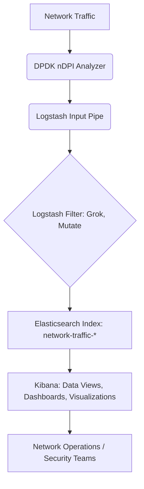

# Enterprise-Grade ELK Stack for Real-time Network Traffic Analysis on Ubuntu 24.04

## Overview

This repository provides an **enterprise-grade solution** for deploying the **ELK Stack** (Elasticsearch, Logstash, Kibana) on Ubuntu 24.04 LTS, specifically tailored for **real-time network traffic analysis**. It integrates with a high-performance **DPDK (Data Plane Development Kit)** and **nDPI (Deep Packet Inspection)** based traffic analyzer to deliver granular insights into network flows, application protocols, and critical security events. This solution is designed for organizations requiring robust network monitoring, advanced security analytics, and efficient performance troubleshooting in demanding, high-throughput network environments.

### Key Features & Benefits:

*   **Automated Deployment**: A comprehensive bash script (`deploy_elk.sh`) automates the entire installation and configuration process, reducing manual errors and deployment time.
*   **Real-time Visibility**: Ingests and visualizes live network traffic data, enabling immediate detection of anomalies and performance bottlenecks.
*   **Deep Packet Inspection**: Leverages nDPI for accurate identification of application protocols, even when running on non-standard ports.
*   **Security Intelligence**: Integrates JA4+ fingerprinting and behavioral risk alerting for proactive threat detection.
*   **Scalable Architecture**: Built on the robust and scalable ELK Stack, capable of handling vast volumes of network data.
*   **Customizable Dashboards**: Provides a foundation for creating tailored Kibana dashboards and visualizations to meet specific operational and security requirements.
*   **Ubuntu 24.04 LTS**: Optimized for the latest long-term support release of Ubuntu, ensuring stability and long-term support.

### SEO Keywords:

*   Enterprise ELK Stack Deployment
*   Ubuntu 24.04 ELK Installation Guide
*   Real-time Network Monitoring Solution
*   DPDK nDPI Traffic Analysis
*   Network Security Analytics Platform
*   Kibana Traffic Visualization
*   Automated ELK Configuration Script
*   High-Performance Packet Inspection
*   Network Observability Tools
*   Security Information and Event Management (SIEM) with ELK

## Table of Contents

1.  [Architecture](#1-architecture)
2.  [Prerequisites](#2-prerequisites)
3.  [Automated Deployment](#3-automated-deployment)
4.  [Manual Installation & Configuration (Optional)](#4-manual-installation--configuration-optional)
    *   [4.1. Elasticsearch](#41-elasticsearch)
    *   [4.2. Kibana](#42-kibana)
    *   [4.3. Logstash](#43-logstash)
    *   [4.4. DPDK nDPI Traffic Analyzer](#44-dpdk-ndpi-traffic-analyzer)
5.  [Kibana Data View & Visualization](#5-kibana-data-view--visualization)
6.  [Security Considerations](#6-security-considerations)
7.  [Troubleshooting](#7-troubleshooting)
8.  [Contributing](#8-contributing)
9.  [License](#9-license)
10. [References](#10-references)

## 1. Architecture

This solution employs a standard ELK Stack architecture augmented with a specialized traffic analyzer:

*   **DPDK nDPI Traffic Analyzer**: A high-performance C application that captures network packets using DPDK and performs deep packet inspection with nDPI. It extracts flow metadata, application protocols, and security alerts.
*   **Logstash**: Acts as the data ingestion pipeline. It receives structured logs from the traffic analyzer, applies Grok filters to parse the data, enriches it, and then forwards it to Elasticsearch.
*   **Elasticsearch**: The distributed search and analytics engine. It stores the processed network traffic data in a scalable and searchable format.
*   **Kibana**: The visualization layer. It connects to Elasticsearch, allowing users to create interactive dashboards, discover patterns, and analyze network behavior in real-time.



## 2. Prerequisites

To deploy this solution, you will need:

*   **Operating System**: Ubuntu 24.04 LTS (Server or Desktop edition).
*   **Hardware Resources**: 
    *   **CPU**: Minimum 4 cores (8+ recommended for production).
    *   **RAM**: Minimum 8 GB (16+ GB recommended for production, especially for Elasticsearch).
    *   **Disk Space**: Minimum 50 GB free space (200+ GB recommended for data retention).
*   **Network**: Stable internet connection for package downloads.
*   **User Privileges**: A user with `sudo` access.
*   **Git**: Installed for cloning repositories.
*   **DPDK nDPI Traffic Lab**: The `dpdk-ndpi-traffic-lab` repository cloned to your system. This guide assumes it's located at `/home/ubuntu/dpdk-ndpi-traffic-lab`.

## 3. Automated Deployment

The `deploy_elk.sh` script automates the entire setup process, from installing dependencies to configuring and starting the ELK services and the traffic analyzer. 

**Usage:**

```bash
chmod +x deploy_elk.sh
sudo ./deploy_elk.sh
```

**What the script does:**

1.  Updates system packages and installs necessary dependencies (Java, `curl`, `git`).
2.  Adds the Elastic GPG key and repository to your system.
3.  Installs Elasticsearch, Kibana, and Logstash.
4.  Configures Elasticsearch for network access (binds to `0.0.0.0`) and disables X-Pack security (for lab environments).
5.  Configures Kibana to connect to Elasticsearch and listen on `0.0.0.0`.
6.  Enables and starts Elasticsearch and Kibana services.
7.  Clones the `dpdk-ndpi-traffic-lab` repository if not already present.
8.  Builds the `dpdk-ndpi-traffic-lab` project.
9.  Creates the Logstash configuration file (`traffic_logstash.conf`).
10. Starts Logstash with the traffic analyzer as an input pipe.

Upon successful execution, the script will output the Kibana URL and instructions for creating the Data View.

## 4. Manual Installation & Configuration (Optional)

For those who prefer a step-by-step manual setup or need to customize specific components, follow these instructions.

### 4.1. Elasticsearch

1.  **Add Elastic GPG Key and Repository:**
    ```bash
wget -qO - https://artifacts.elastic.co/GPG-KEY-elasticsearch | sudo gpg --dearmor -o /usr/share/keyrings/elasticsearch-keyring.gpg
echo "deb [signed-by=/usr/share/keyrings/elasticsearch-keyring.gpg] https://artifacts.elastic.co/packages/8.x/apt stable main" | sudo tee /etc/apt/sources.list.d/elastic-8.x.list
sudo apt-get update
    ```
2.  **Install Elasticsearch:**
    ```bash
sudo apt-get install -y elasticsearch
    ```
3.  **Configure Elasticsearch:**
    Edit `/etc/elasticsearch/elasticsearch.yml` to allow external access and disable security (for testing):
    ```yaml
    # /etc/elasticsearch/elasticsearch.yml
    network.host: 0.0.0.0
    xpack.security.enabled: false
    ```
4.  **Start Elasticsearch:**
    ```bash
sudo systemctl daemon-reload
sudo systemctl enable elasticsearch.service
sudo systemctl start elasticsearch.service
    ```
5.  **Verify:**
    ```bash
curl -X GET "localhost:9200/?pretty"
    ```

### 4.2. Kibana

1.  **Install Kibana:**
    ```bash
sudo apt-get install -y kibana
    ```
2.  **Configure Kibana:**
    Edit `/etc/kibana/kibana.yml` to bind to all interfaces and connect to Elasticsearch:
    ```yaml
    # /etc/kibana/kibana.yml
    server.host: "0.0.0.0"
    elasticsearch.hosts: ["http://localhost:9200"]
    ```
3.  **Start Kibana:**
    ```bash
sudo systemctl enable kibana.service
sudo systemctl start kibana.service
    ```

### 4.3. Logstash

1.  **Install Logstash:**
    ```bash
sudo apt-get install -y logstash
    ```
2.  **Create Logstash Configuration (`traffic_logstash.conf`):**
    Create the file `/home/ubuntu/traffic_logstash.conf` with the content provided in the [Automated Deployment](#3-automated-deployment) section or the `traffic_logstash.conf` file in this repository.

3.  **Start Logstash:**
    ```bash
sudo /usr/share/logstash/bin/logstash -f /home/ubuntu/traffic_logstash.conf --path.settings /etc/logstash > /home/ubuntu/logstash.log 2>&1 &
    ```

### 4.4. DPDK nDPI Traffic Analyzer

1.  **Clone Repository (if not already done):**
    ```bash
git clone https://github.com/RajaMuhammadAwais/dpdk-ndpi-traffic-lab.git /home/ubuntu/dpdk-ndpi-traffic-lab
    ```
2.  **Build Project:**
    ```bash
cd /home/ubuntu/dpdk-ndpi-traffic-lab
sudo ./setup.sh
make
    ```

## 5. Kibana Data View & Visualization

Once all components are running and Logstash is ingesting data, you can access Kibana to create your visualizations.

1.  **Access Kibana**: Open your web browser and navigate to the Kibana URL (e.g., `http://<your-server-ip>:5601`). If running in a sandbox, use the exposed public URL.
2.  **Create Data View**: 
    *   In Kibana, go to **Analytics > Discover**.
    *   Click on **"Create data view"**.
    *   For the **Index pattern**, enter `network-traffic-*`.
    *   For the **Time field**, select `@timestamp`.
    *   Give your Data View a descriptive name, e.g., "Network Traffic Data".
    *   Click **"Create data view"**.
3.  **Explore and Visualize**: Use the Discover interface to explore raw logs. Navigate to **Analytics > Visualize Library** and **Analytics > Dashboard** to create custom charts and dashboards for:
    *   Protocol distribution (Pie chart)
    *   Top source/destination IPs and ports (Bar charts)
    *   Security alerts over time (Line graph)
    *   JA4 fingerprints analysis (Data table)

## 6. Security Considerations

**IMPORTANT**: The provided configuration disables X-Pack security in Elasticsearch for ease of initial setup. For any production deployment, it is **CRITICAL** to enable and properly configure security features, including:

*   **User Authentication and Authorization**: Implement role-based access control (RBAC).
*   **TLS/SSL Encryption**: Encrypt communication between all ELK components and client access.
*   **IP Filtering**: Restrict access to Elasticsearch and Kibana to trusted IP addresses.
*   **Firewall Rules**: Configure your server's firewall to only allow necessary ports (e.g., 5601 for Kibana, 9200 for Elasticsearch if direct access is required, 5044 for Beats if used).

Refer to the official Elastic documentation for detailed security best practices [1].

## 7. Troubleshooting

*   **Elasticsearch/Kibana/Logstash not starting**: Check service logs for errors:
    *   `sudo journalctl -u elasticsearch.service`
    *   `sudo journalctl -u kibana.service`
    *   `tail -f /home/ubuntu/logstash.log`
*   **No data in Kibana**: 
    *   Verify Logstash is running and its pipeline is correct.
    *   Check Elasticsearch health: `curl -X GET "localhost:9200/_cat/health?v"`.
    *   Ensure the `network-traffic-*` index exists: `curl -X GET "localhost:9200/_cat/indices?v"`.
*   **DPDK nDPI Analyzer issues**: Ensure `setup.sh` and `make` completed successfully. Check for any error messages during execution.

## 8. Contributing

Contributions are welcome! Please refer to the `CONTRIBUTING.md` file (if available) or submit issues and pull requests through the GitHub repository.

## 9. License

This project is distributed under the **BSD 3-Clause License**. See the `LICENSE` file in the repository for full details.

## 10. References

[1] Elasticsearch Security Documentation: [https://www.elastic.co/guide/en/elasticsearch/reference/current/security-settings.html](https://www.elastic.co/guide/en/elasticsearch/reference/current/security-settings.html)
[2] DPDK Official Website: [https://www.dpdk.org/](https://www.dpdk.org/)
[3] nDPI GitHub Repository: [https://github.com/ntop/nDPI](https://github.com/ntop/nDPI)
[4] dpdk-ndpi-traffic-lab GitHub Repository: [https://github.com/RajaMuhammadAwais/dpdk-ndpi-traffic-lab](https://github.com/RajaMuhammadAwais/dpdk-ndpi-traffic-lab)
